

# 두잉 Du-ing

**대구대학교 동아리 통합 플랫폼**

흩어져 있던 동아리 정보와 모집·지원·운영 업무를 한곳에 모은 서비스입니다. 
재학생은 동아리를 찾고 지원하며, 동아리 운영진은 모집부터 부원·회비 관리까지, 총동아리연합회는 동아리와 캠퍼스 소식을 관리합니다.

[🌐 duings.com](https://www.duings.com)

---

- [🙋 사용자 가이드](#-사용자-가이드) — 재학생
- [🧰 동아리 운영진 가이드](#-동아리-운영진-가이드) — 회장·임원진
- [🏫 총동연 관리자 가이드](#-총동연-관리자-가이드) — 총동아리연합회
- [💻 개발자 문서](#-개발자-문서)

> 홈·동아리 탐색·캠퍼스 일정·시설 예약 현황·캠퍼스 소식은 [duings.com](https://www.duings.com) 실서비스에서, 나머지는 로컬 개발 환경에서 녹화했습니다. 로컬은 문자 인증이 스텁이라 회원가입 화면에 실제 QR 대신 안내 문구가 보이고 인증이 바로 끝납니다. 로컬 녹화에 나오는 동아리 "코드브루"와 학생·연락처 등은 모두 개발용 가상 데이터입니다.

---

## 🙋 사용자 가이드

### 회원가입

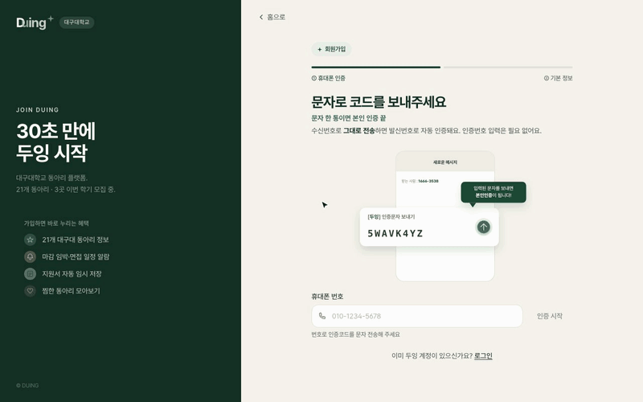

- 화면에 표시된 코드를 문자로 한 번 보내면 휴대폰 본인 인증이 끝납니다. 인증번호를 따로 입력할 필요가 없습니다.
- 이름·단과대학·학과·학번·학년을 입력하고 약관에 동의하면 가입이 완료됩니다.
- 학번은 한 번 더 입력해 확인하므로 오타로 잘못 가입하는 일을 막습니다.

### 홈

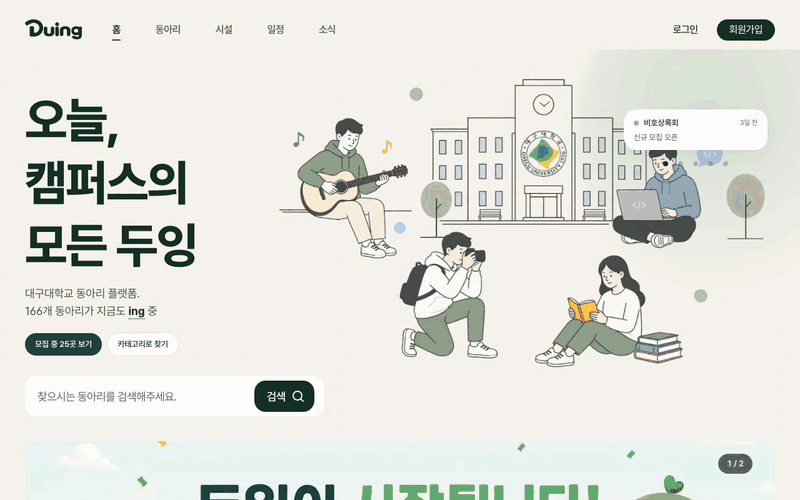

- 메인 배너에서 총동연과 동아리의 주요 소식·홍보를 확인할 수 있습니다.
- 마감이 임박한 동아리 모집이 띠 배너로 흘러갑니다.
- 이번 주 관심을 많이 받은 동아리와 카테고리별 바로가기를 제공합니다.

### 동아리 탐색

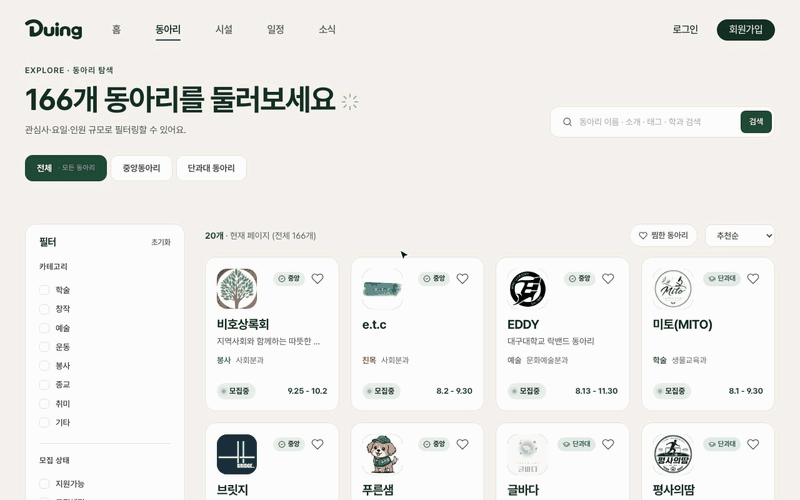

- 전체·중앙동아리·단과대 동아리 범위를 나눠 볼 수 있습니다.
- 카테고리, 모집 상태, 활동 요일, 분과(단과대학) 필터를 조합해 원하는 동아리를 찾을 수 있습니다.
- 동아리 이름·소개·태그·학과로 검색하고, 추천순·마감 임박순·가나다순으로 정렬합니다.

### 동아리 상세

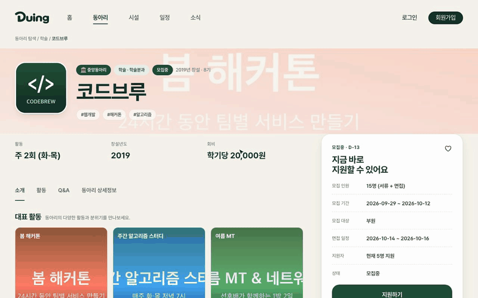

- 활동 빈도, 창설년도, 회비와 대표 활동 사진을 한 화면에서 확인할 수 있습니다.
- 모집 중인 동아리는 오른쪽 카드에서 모집 인원·기간·대상과, 동아리가 공개한 경우 현재 지원자 수를 보고 바로 지원할 수 있습니다.
- 소개·활동·Q&A·상세정보 탭과 찜하기를 제공합니다.

### 동아리 지원하기

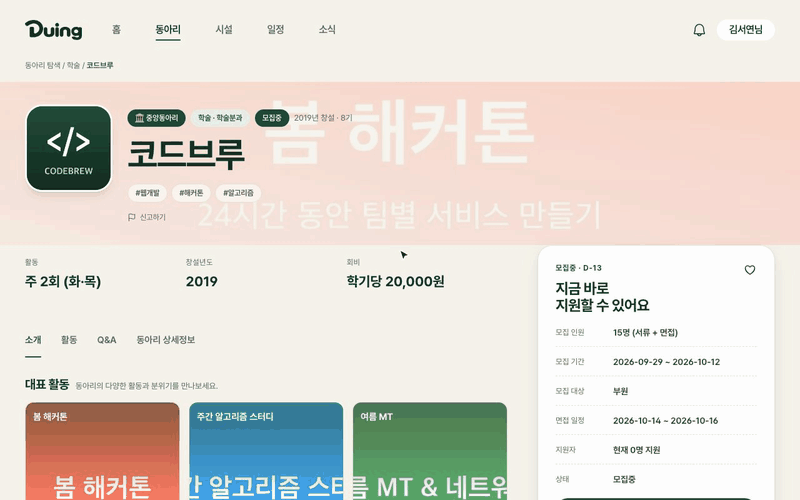

- 자체 폼으로 모집하는 동아리는 외부 사이트로 이동하지 않고, 동아리가 만든 지원서(주관식·객관식)를 두잉 안에서 작성합니다. 외부 폼 모집은 해당 폼으로 연결됩니다.
- 작성 중인 지원서는 자동으로 임시 저장됩니다.
- 제출 후에는 지원 상세에서 진행 단계를 확인하고, 필요하면 지원을 철회할 수 있습니다.

### 면접 시간 선택

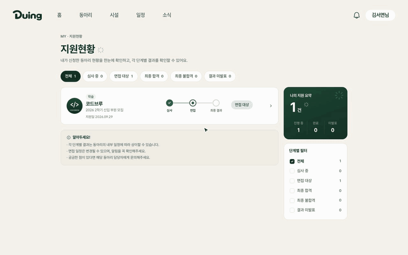

- 면접 대상이 되어 운영진이 면접 라운드를 발송하면 알림으로 안내를 받습니다.
- 동아리가 열어 둔 면접 시간 중 가능한 시간을 여러 개 골라 제출합니다.
- 마감 전까지는 선택한 시간을 다시 변경할 수 있습니다.

### 마이페이지

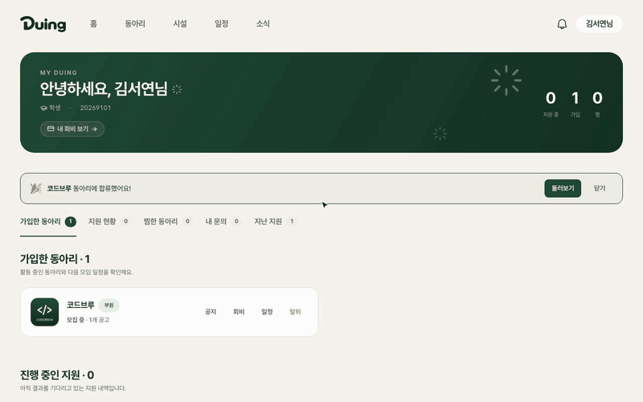

- 가입한 동아리마다 공지·회비·일정으로 바로 이동할 수 있습니다.
- 진행 중인 지원, 찜한 동아리, 1:1 문의, 지난 지원(합격·불합격 결과)을 탭으로 모아 봅니다.

### 캠퍼스 일정

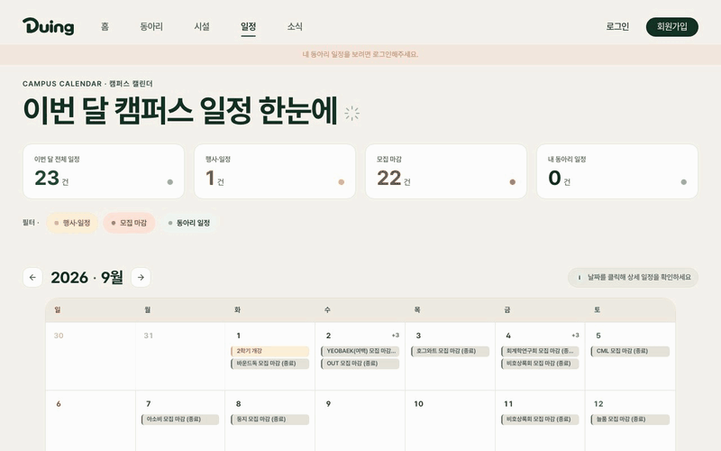

- 이번 달의 행사·모집 마감·내 동아리 일정을 달력 하나로 확인할 수 있습니다.
- 일정 종류별로 필터를 켜고 끌 수 있고, 날짜를 누르면 그날의 상세 일정이 열립니다.

### 시설 예약 현황

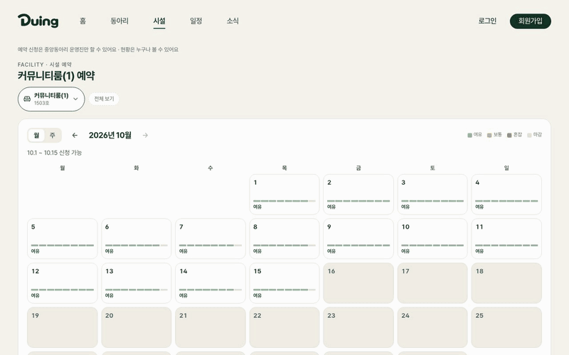

- 학생회관 시설의 예약 현황을 월·주 단위로 누구나 확인할 수 있습니다.
- 날짜별 여유·혼잡 정도와 시간대별 예약 상태를 보여 줍니다.
- 예약 신청은 중앙동아리 운영진만 할 수 있습니다.

### 캠퍼스 소식

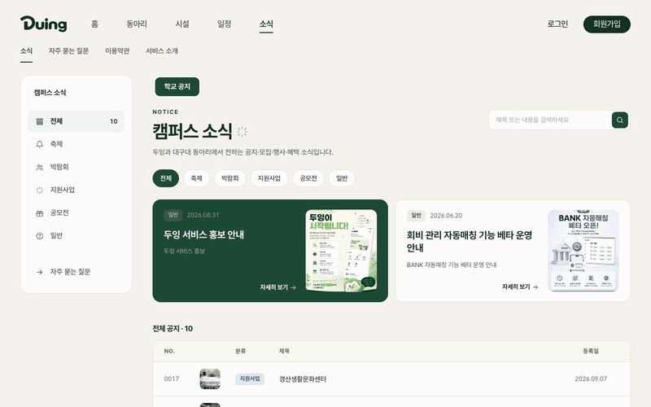

- 총동연이 올리는 공지를 축제·박람회·지원사업·공모전·일반 카테고리로 나눠 봅니다.
- 제목·요약 검색을 지원하고, 행사 공지에는 일시·장소·주최 정보가 함께 표시됩니다.

---

## 🧰 동아리 운영진 가이드

회장·임원진은 로그인 후 오른쪽 위 이름 메뉴의 **운영진 콘솔**에서 동아리를 관리합니다.

### 동아리 정보 관리

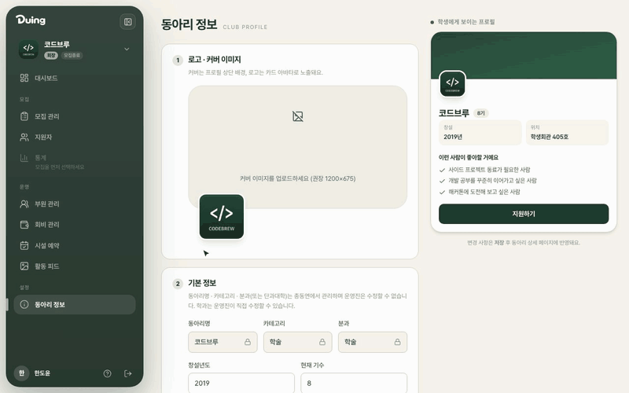

- 커버·로고 이미지, 창설년도·기수·동아리방 위치, 대표 연락처와 공개 범위를 관리합니다.
- 활동 요일·빈도, 회비(납부 주기·금액), 한줄 소개·해시태그·서식 있는 소개글을 입력합니다.
- "이런 사람이 좋아할 거예요", 대표 프로젝트, SNS 링크, 자주 묻는 질문도 등록할 수 있습니다.
- 입력한 내용은 오른쪽 "학생에게 보이는 프로필" 미리보기에 바로 반영됩니다.

### 활동 피드

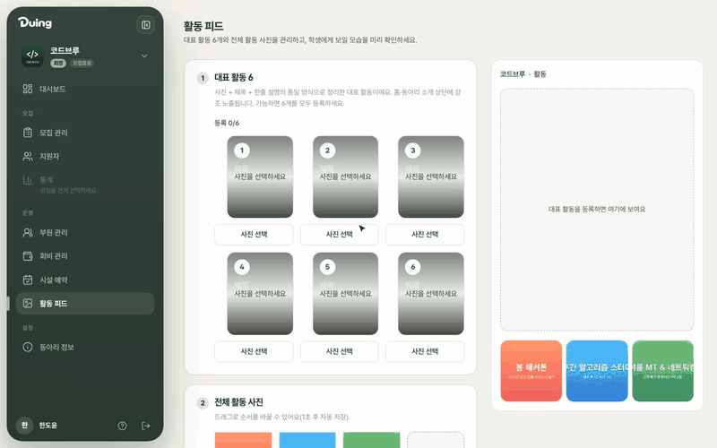

- 동아리 상세 상단에 노출되는 대표 활동 6개를 사진·제목·설명으로 구성합니다.
- 새 사진을 올리거나 이미 올린 활동 사진 중에서 고를 수 있습니다.
- 전체 활동 사진은 드래그로 순서를 바꿀 수 있습니다.

### 모집 공고 작성

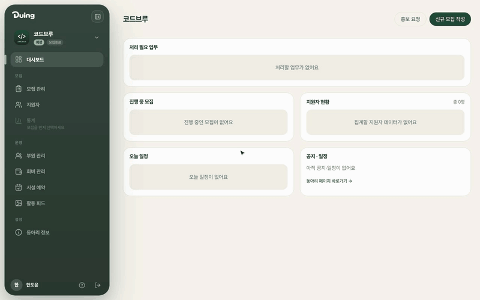

- 모집 기간(또는 상시모집), 모집 인원, 모집 대상(부원·운영진)을 정합니다.
- 두잉 자체 지원서와 외부 폼 중에서 지원 방식을 고를 수 있습니다.
- 면접 진행 여부와 면접 기간, 지원자 수 공개 여부를 설정합니다.
- 안내문(Markdown)과 지원서 질문(주관식·객관식 단일/복수 선택, 필수 여부)을 작성합니다.
- 오른쪽 미리보기로 학생에게 보일 화면을 확인하면서 작성하고, 공개합니다.

### 지원자 관리

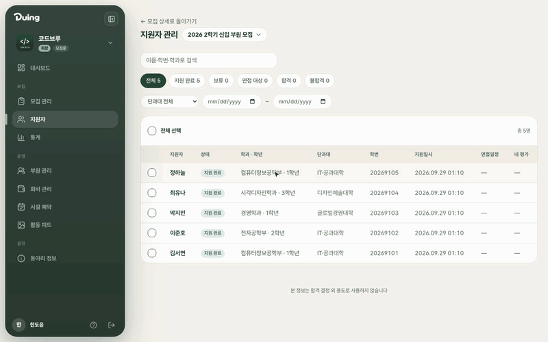

- 상태(지원 완료·보류·면접 대상·합격·불합격), 이름·학번·학과 검색, 단과대·지원일 필터로 지원자를 찾습니다.
- 지원서를 열어 1~5점 평가와 메모를 남깁니다. 평가와 메모는 지원자에게 공개되지 않습니다.
- 다른 운영진의 평가도 함께 볼 수 있습니다.
- 여러 지원자를 선택해 면접 대상 선정, 합격, 불합격, 보류를 한 번에 처리합니다.

### 면접 관리

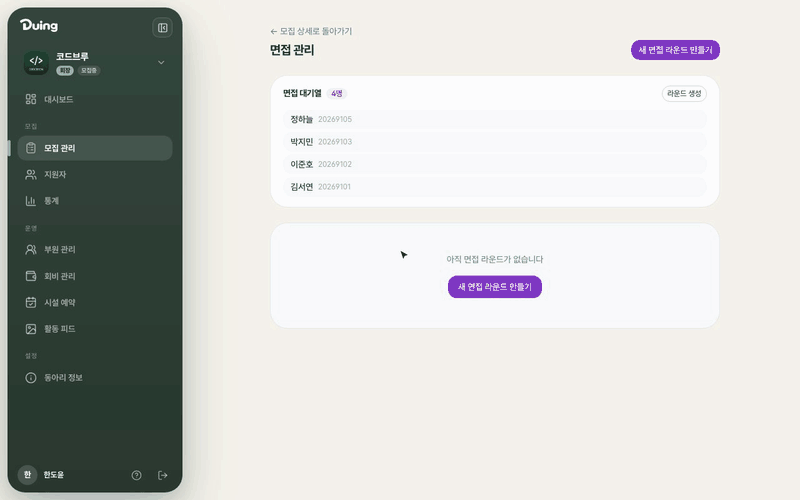

- 면접 라운드는 4단계로 만듭니다: 대상 선정 → 라운드 정보(제목·응답 마감·장소) → 면접 슬롯 등록 → 검토·발송.
- 발송하면 대상 지원자에게 알림이 가고, 지원자가 가능한 시간을 제출합니다.
- 응답 수집 현황은 라운드별로 확인합니다.

### 모집 통계

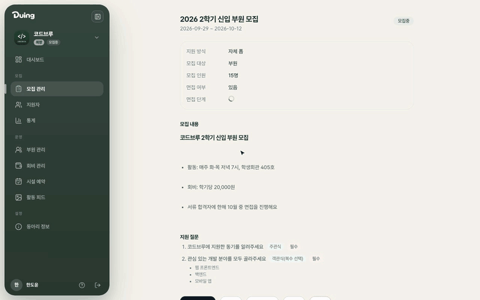

- 전체·보류·면접 대기·합격·불합격 인원과 모집 인원 대비 합격률을 보여 줍니다.
- 일자별 지원 추이와 전형 단계별 현황을 그래프로 확인합니다.

### 부원 관리

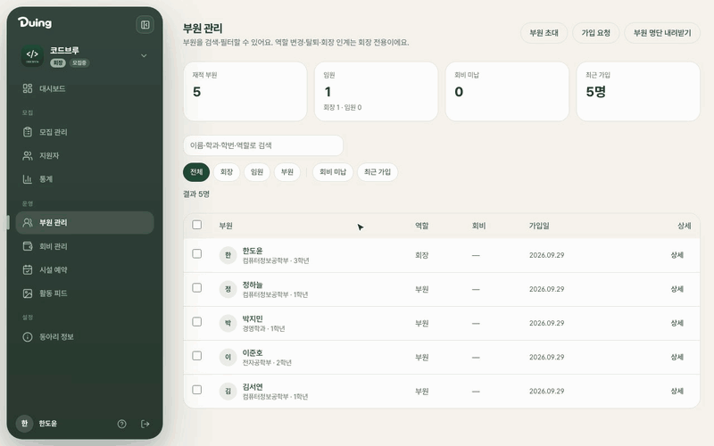

- 부원 명단을 이름·학과·학번·역할로 검색하고, 역할·회비 미납·최근 가입으로 필터링합니다.
- 이미 활동 중인 부원은 초대 링크로 가입시킬 수 있습니다. 최대 인원, 유효기간, 자동 승인 여부를 정해서 만들고 QR로도 공유합니다.
- 가입 요청 승인과 부원 명단 내려받기를 지원합니다.

### 회비 관리

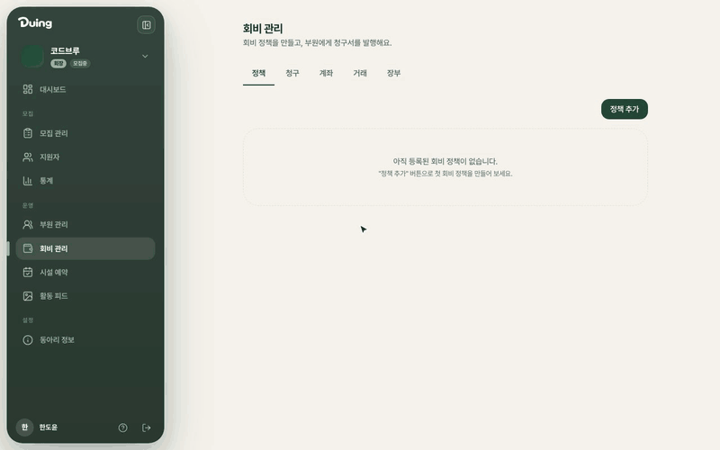

- 회비 정책(월·학기·연·일회성, 전체 또는 특정 부원 대상, 매월 자동 발행)을 만듭니다.
- 회차·기간·마감일을 정해 청구서를 발행하면, 부원별 납부 현황을 확인하고 납부를 기록할 수 있습니다.
- 계좌·거래·장부 탭에서 입금 내역과 동아리 장부를 관리합니다.

> 그 밖에 콘솔 대시보드의 **홍보 요청**, 중앙동아리의 **시설 예약** 신청, 운영진의 **회장 승계 요청**을 지원합니다.

---

## 🏫 총동연 관리자 가이드

총동아리연합회 계정으로 로그인하면 상단 메뉴에 **총동연**이 나타납니다.

### 동아리 등록·승인

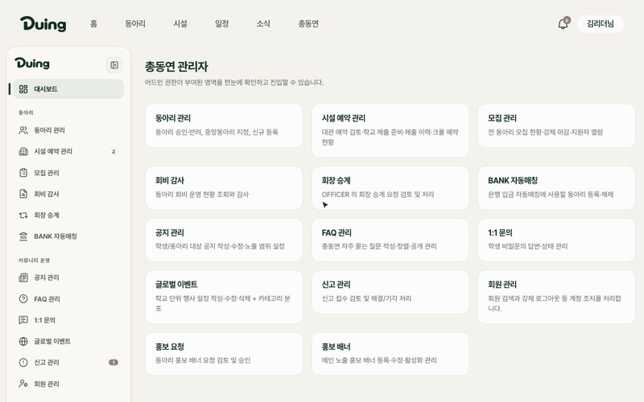

- 동아리 이름, 카테고리, 중앙동아리 여부(분과) 또는 단과대학, 로고를 입력해 신규 동아리를 등록합니다.
- 등록할 때 회장을 학번·이름으로 검색해 지정하면, 해당 학생이 곧바로 회장으로 등록됩니다. 운영진 콘솔은 승인 후부터 쓸 수 있습니다.
- 등록된 동아리는 승인 대기 상태로 시작합니다. 승인하면 학생 탐색 화면에 노출되고, 거절도 할 수 있습니다.
- 중앙동아리 지정·해제, 운영 중단·재활성도 목록에서 처리합니다.

### 공지 작성

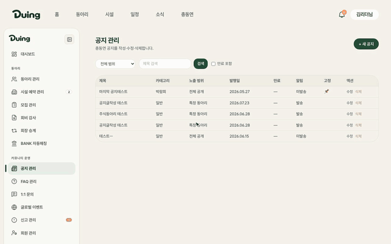

- 제목, 카드용 요약, 대표 이미지, 서식 있는 본문을 작성합니다.
- 행사 공지에는 일시·장소·주최·대상을 넣을 수 있습니다.
- 카테고리와 태그를 붙이고, 노출 범위(전체 공개·전 동아리 운영진·특정 동아리)를 정합니다.
- 상단 고정과 알림 발송을 선택할 수 있습니다.

### 홍보 배너

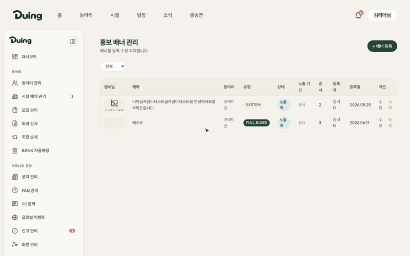

- 홈 메인 배너는 두 가지로 만들 수 있습니다.
  - **시스템 조합형**: 제목·태그·부제·CTA·이모지와 팔레트를 조합합니다.
  - **완성 이미지형**: 업로드한 포스터를 그대로 사용합니다.
- 배너를 누르면 이동할 곳(URL·공지·동아리)을 연결하고, 노출 기간과 순서를 정합니다.

### 1:1 문의

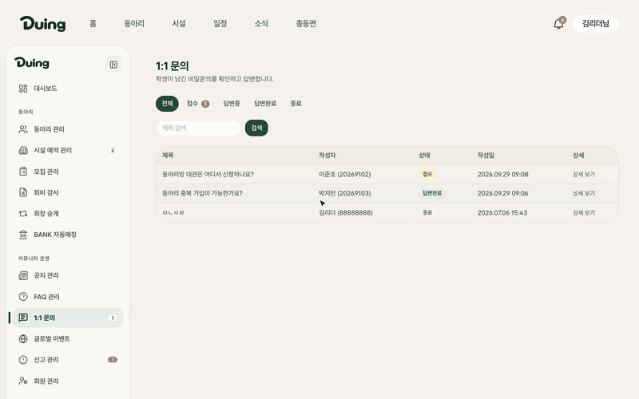

- 학생이 남긴 비밀 문의를 접수·답변중·답변완료·종료 상태로 나눠 관리합니다.
- 문의 상세에서 답변을 작성하면 학생의 마이페이지 "내 문의"에서 확인할 수 있습니다.

### 시설 예약 관리

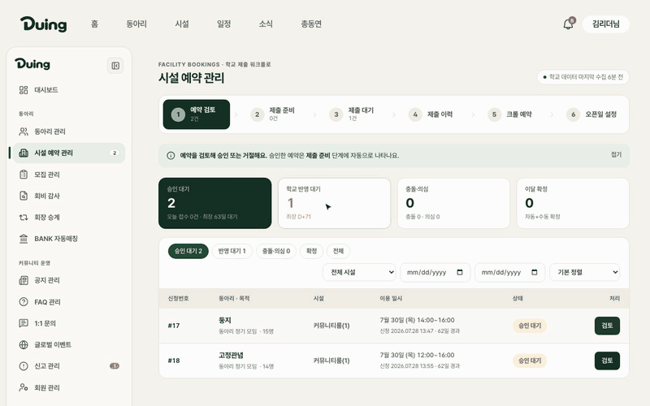

- 학생회관 시설 예약은 4단계 제출 워크플로(예약 검토 → 제출 준비 → 제출 대기 → 제출 이력)로 처리하고, 크롤 예약 조회와 오픈일 설정 화면을 함께 제공합니다.
- 검토 창은 신청 시간대를 학교 일정과 이미 승인된 예약에 대해 자동으로 겹침 검사합니다. 그 결과를 보고 승인하거나 거절합니다.
- 학교 시스템에서 수집한 예약 현황을 반영해 실제 사용 가능 여부를 맞춥니다.

> 그 밖에 전 동아리 **모집 관리**, **회비 감사**, **회장 승계**, **BANK 자동매칭**, **FAQ·글로벌 이벤트**, **신고**, **회원 관리**, **홍보 요청** 검토를 지원합니다.

---

## 💻 개발자 문서

| 문서 | 내용 |
|---|---|
| [`DEVELOPMENT.md`](./DEVELOPMENT.md) | 빠른 시작 · 기술 스택 · 권한 모델 · 협업 규칙 · 환경변수/시크릿 |
| [`backend/README.md`](./backend/README.md) | 백엔드 (Spring Boot 3.4 · Java 21) |
| [`frontend/README.md`](./frontend/README.md) | 프론트엔드 (Next.js 16 · React 19) |
| [`deploy/README.md`](./deploy/README.md) | 배포 순서 · 롤백 런북 |
| [`REQUIREMENTS.md`](./REQUIREMENTS.md) | 요구사항 정의서 |
