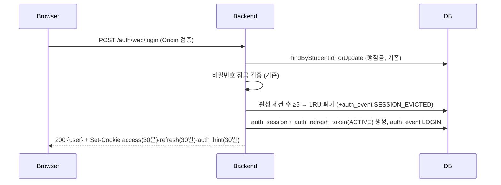
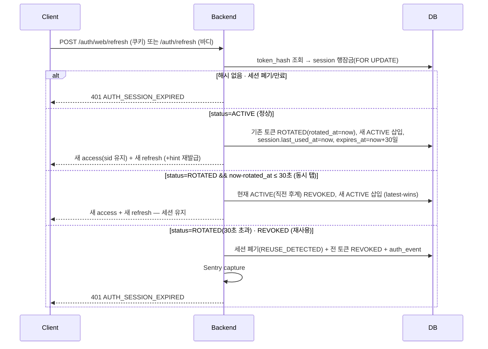

# Refresh Token · 세션 인증 시스템 설계

- 날짜: 2026-07-18
- 선행 스펙: [2026-07-13 웹 Cookie·Bearer 이중 transport](./2026-07-13-web-auth-cookie-bearer-dual-transport-design.md), [2026-06-19 관리자 강제 로그아웃](./2026-06-19-admin-force-logout-design.md)

## 1. 목표

Access Token 단일(1시간, 만료 시 강제 재로그인) 구조를 **Access 30분 + Refresh 30일(Sliding·Rotation) + 서버 세션 테이블** 구조로 전환한다. 웹(HttpOnly Cookie)과 향후 React Native(Bearer + Secure Storage)가 **같은 백엔드 계약**을 쓰고, 세션/디바이스 단위 관리(목록·개별/전체 로그아웃)와 탈취 대응(Rotation·재사용 탐지·Audit)을 운영 가능한 수준으로 갖춘다.

## 2. 현재 구조와 문제

- Access JWT(HS256, exp 정확히 1시간 고정 — `JwtTokenProvider`·`AuthHintTokenProvider`가 부팅 시 강제) 하나뿐. 만료되면 `SessionExpiryHandler`가 `/login`으로 보낸다 → **1시간마다 강제 재로그인**.
- 폐기 수단은 `users.token_version` 전역 범프뿐 → **기기 단위 로그아웃 불가**, 로그인 중인 기기 목록도 없음.
- 웹은 `__Host-duing_access_token` + `auth_hint` HttpOnly 쿠키(2026-07-13 스펙), 모바일은 Bearer(`POST /auth/login`)로 transport 이원화가 **이미 완료**되어 있어, Refresh도 같은 이원화 위에 얹으면 된다.

## 3. 범위

### 3.1 이번 시리즈에서 하는 것

- 세션·리프레시·감사 테이블(V86)과 도메인 로직(발급·Rotation·재사용 탐지·LRU 상한)
- `POST /auth/web/refresh`(쿠키)·`POST /auth/refresh`(바디) API와 웹 쿠키 계약 개편(Access 30분)
- FE 401 → 자동 갱신(크로스탭 single-flight) → 원요청 재시도
- 세션 목록·개별/전체 로그아웃 API + 마이페이지 UI, 관리자 강제 로그아웃의 세션 연동
- 만료 세션 정리 잡, 인증 감사 로그(auth_event)

### 3.2 Out of Scope

- **CSRF 토큰(Double Submit) 도입 — 하지 않는다.** §15에서 결론과 재검토 트리거를 남긴다.
- React Native 앱 구현(레포 미존재). 서버 계약과 계약 테스트만 이번에 고정한다(§16).
- 로그인 화면 "로그인 상태 유지" 체크박스 연동(현재 미연결 상태 유지). 후속 후보로만 기록(§5.6).
- 이메일/소셜 로그인, 2FA, 디바이스 신뢰 등 인증 수단 확장.
- Access Token의 요청 단위 세션 검증(짧은 TTL + tokenVersion으로 충분, §5.5).

## 4. 최종 인증 정책

| 항목 | 정책 |
|---|---|
| Access Token | JWT HS256, **30분**, 클레임 `sub`·`role`·`tokenVersion`·**`sid`(세션 id, 신규)**. 웹=HttpOnly 쿠키, 모바일=Bearer |
| Refresh Token | **JWT 아님** — `SecureRandom` 256bit → base64url. DB엔 **SHA-256 해시만** 저장(UNIQUE) |
| Refresh 수명 | **30일 Sliding** — Rotation 때마다 `expires_at = now + 30일` 갱신. 절대 상한 없음(재사용 탐지가 보정) |
| Rotation | Refresh 사용 시마다 새 토큰 발급, 기존 토큰 즉시 `ROTATED` 처리. 세션 행잠금으로 원자화 |
| 재사용 탐지 | 폐기된 토큰 재사용 = 세션(패밀리) 전체 폐기 + audit + Sentry. 단 rotation 후 **grace(운영 설정값, 기본 30초)** 안의 재사용은 멀티탭 경합으로 간주(§11) |
| 동시 세션 | 사용자당 **최대 5개**, 초과 로그인 시 `last_used_at` 기준 LRU 자동 폐기 |
| 로그아웃 | 현재 기기=해당 세션만 폐기(tokenVersion 범프 **중단** — 의미 변화 §13.2), 전체=전 세션 폐기+범프 |
| 비밀번호 변경·재설정·번호 변경·탈퇴·관리자 강제 로그아웃 | 전 세션 폐기 + tokenVersion 범프(기존 범프 지점 6곳에 세션 폐기 연결) |
| 웹/모바일 TTL | 동일(Access 30분·Refresh 30일). transport만 다름 |

## 5. 검토한 대안과 결정

### 5.1 Refresh를 JWT로 — 제외
Stateless JWT refresh는 폐기·세션 목록·재사용 탐지가 안 된다. 어차피 세션 테이블이 필요하므로 opaque 랜덤 토큰 + 해시 저장이 단순하고 안전하다(서명 키 관리 대상도 늘지 않음).

### 5.2 세션 = 토큰 패밀리 (요청서의 `refresh_hash`+`token_family_id` 동거 구조 개선)
세션 행에 현재 해시만 두면 rotation 시 덮어써서 **한 세대 전 토큰까지만** 재사용을 탐지할 수 있다. 세션 자체를 패밀리로 두고(`token_family_id` 별도 컬럼 불필요 — `session_id`가 곧 패밀리 id), rotation 이력을 `auth_refresh_token` 행으로 남기는 **2-테이블 구조**를 채택한다. 임의 세대의 폐기 토큰 재사용을 탐지할 수 있고, "ACTIVE는 세션당 1개" 불변식을 부분 UNIQUE 인덱스로 DB가 강제한다.

### 5.3 "즉시 폐기" vs 멀티탭 오탐 — grace window의 latest-wins
요구사항의 "기존 Refresh 즉시 폐기"와 "멀티탭 오탐 방지"는 그대로 두면 충돌한다(폐기 직후 다른 탭의 재사용 = 오탐). 해소: 폐기(ROTATED 마킹)는 즉시 하되, **rotated_at 기준 30초 안의 ROTATED 토큰 제시는 탈취가 아닌 동시 탭으로 간주**하고 한 번 더 정상 rotation을 허용하며 직전 후계 토큰을 REVOKED로 교체한다(latest-wins, §11). 웹은 쿠키 저장소가 탭 간 공유라 마지막 Set-Cookie가 이기므로 이 모델과 정합적이다. 30초 밖은 전부 재사용 탐지.

### 5.4 재사용 탐지 시 폐기 범위 — 해당 세션만
전 세션 폐기는 오탐 시 타격이 크다. 초기엔 해당 세션(패밀리)만 폐기 + audit + Sentry. 패턴이 보이면 전 세션 폐기로 강화할 수 있게 폐기 로직은 세션 단위 메서드로 분리해 둔다.

### 5.5 Access 요청 단위 세션 검증 — 하지 않음
`JwtAuthenticationFilter`는 이미 매 요청 사용자 행을 읽어 tokenVersion을 검증한다. 세션 검증까지 얹으면 JWT가 사실상 stateful해진다. 개별 세션 폐기 후 그 세션의 Access가 최대 30분 살아있는 것은 수용한다(그래서 30분이 1시간보다 낫다). 즉시성이 필요한 이벤트(비번 변경·강제 로그아웃)는 기존대로 tokenVersion 범프가 전 기기 Access를 즉시 무효화한다.

### 5.6 "로그인 상태 유지" 체크박스 — 이번엔 미연동
로그인 화면에 체크박스가 있으나 현재 상태에 연결돼 있지 않다(rememberMe 미사용). 이번 시리즈는 30일 고정으로 가고, 미체크 시 브라우저 세션 쿠키(+짧은 expires_at)로 낮추는 연동은 후속 후보로 남긴다. 그 전까지 체크박스를 숨길지는 FE PR에서 판단한다.

### 5.7 감사 로그에 REFRESH 성공 이벤트 — 남기지 않음
활성 사용자당 30분마다 1행은 소음이다. 보안 의미가 있는 이벤트만 남긴다(§7.3). Rotation 자체는 `auth_refresh_token` 행이 이력이다.

## 6. 아키텍처 개요 (DDD 배치)

인증은 현재 `domain/user`에 있으므로 그대로 확장한다. 신규 클래스:

```
domain/user/
├── api/AuthApi.java                    # refresh 2종 추가 (기존 파일)
├── controller/AuthController.java      # 〃
├── entity/AuthSession.java             # 세션(=토큰 패밀리)
├── entity/AuthRefreshToken.java        # rotation 이력 (ACTIVE|ROTATED|REVOKED)
├── entity/AuthEvent.java               # append-only 감사 이벤트
├── repository/AuthSessionRepository.java / AuthRefreshTokenRepository.java / AuthEventRepository.java
├── service/AuthSessionService.java + GeneralAuthSessionService.java
│     issue(로그인 시 세션+토큰 발급, LRU), rotate(§11), revoke/revokeAll, listSessions
├── job/AuthSessionCleanupJob.java      # §18.1
global/auth/
├── RefreshTokenGenerator.java          # SecureRandom 256bit + SHA-256 해시
├── WebAuthCookieService.java           # refresh 쿠키 추가, 수명 계약 개편 (기존 파일)
├── AuthHintTokenProvider.java          # hint 수명을 세션 지평선으로 (기존 파일)
├── JwtTokenProvider.java               # 30분 고정 + sid 클레임 (기존 파일)
└── CookieCsrfOriginFilter.java         # web refresh 경로 추가 (기존 파일)
```

`GeneralUserService.login()`은 기존 행잠금 흐름 끝에 `authSessionService.issue(...)`를 호출하고, tokenVersion 범프 6지점(logout 제외, §13)은 `revokeAll(...)`을 함께 호출한다.

## 7. DB 설계 — `V86__create_auth_session_tables.sql`

레포 컨벤션(BIGSERIAL, created/updated/deleted_at 트리오, 테이블별 RLS enable, append-only 전례 `phone_verification_events`·`*_status_history`)을 따른다.

```sql
-- 세션 = 리프레시 토큰 패밀리. revoked_at 이 논리 폐기(soft delete 아님),
-- 물리 삭제는 AuthSessionCleanupJob 이 보존기간 후 수행(PiiRetentionJob 전례).
CREATE TABLE auth_session (
    id            BIGSERIAL PRIMARY KEY,
    user_id       BIGINT      NOT NULL REFERENCES users (id),
    platform      VARCHAR(20) NOT NULL,             -- WEB | IOS | ANDROID | UNKNOWN
    device_label  VARCHAR(100),                     -- 모바일=클라이언트 제공, 웹=UA 요약
    user_agent    VARCHAR(500),
    ip_address    VARCHAR(45),                      -- IPv6 텍스트 최대 45자
    last_used_at  TIMESTAMP   NOT NULL DEFAULT NOW(),
    expires_at    TIMESTAMP   NOT NULL,             -- sliding: rotation 마다 now+30일
    revoked_at    TIMESTAMP,
    revoke_reason VARCHAR(30),                      -- LOGOUT|LOGOUT_ALL|SESSION_LIMIT|REUSE_DETECTED|CREDENTIAL_CHANGE|ADMIN_FORCE|EXPIRED
    created_at    TIMESTAMP   NOT NULL DEFAULT NOW(),
    updated_at    TIMESTAMP   NOT NULL DEFAULT NOW(),
    deleted_at    TIMESTAMP
);
-- 활성 세션 조회(목록·LRU·상한 계산) 전용 부분 인덱스
CREATE INDEX idx_auth_session_user_active ON auth_session (user_id, last_used_at) WHERE revoked_at IS NULL;

CREATE TABLE auth_refresh_token (
    id         BIGSERIAL PRIMARY KEY,
    session_id BIGINT      NOT NULL REFERENCES auth_session (id),
    token_hash CHAR(64)    NOT NULL,                -- SHA-256 hex. 원문은 어디에도 저장하지 않는다
    status     VARCHAR(10) NOT NULL,                -- ACTIVE | ROTATED | REVOKED
    rotated_at TIMESTAMP,                           -- ROTATED 전환 시각 = grace 기준점
    created_at TIMESTAMP   NOT NULL DEFAULT NOW(),
    updated_at TIMESTAMP   NOT NULL DEFAULT NOW(),
    deleted_at TIMESTAMP
);
CREATE UNIQUE INDEX uq_auth_refresh_token_hash   ON auth_refresh_token (token_hash);
-- 불변식: 세션당 ACTIVE 토큰은 최대 1개 — 동시 rotation 버그의 DB 백스톱
CREATE UNIQUE INDEX uq_auth_refresh_token_active ON auth_refresh_token (session_id) WHERE status = 'ACTIVE';

-- 인증 보안 이벤트 감사 로그. append-only (phone_verification_events 전례)
CREATE TABLE auth_event (
    id         BIGSERIAL PRIMARY KEY,
    user_id    BIGINT      REFERENCES users (id),
    session_id BIGINT,                              -- FK 미지정: 세션 물리삭제 후에도 이벤트 보존
    event_type VARCHAR(40) NOT NULL,
    detail     VARCHAR(500),
    ip_address VARCHAR(45),
    user_agent VARCHAR(500),
    created_at TIMESTAMP   NOT NULL DEFAULT NOW(),
    updated_at TIMESTAMP   NOT NULL DEFAULT NOW(),
    deleted_at TIMESTAMP
);
CREATE INDEX idx_auth_event_user ON auth_event (user_id, created_at);

ALTER TABLE auth_session       ENABLE ROW LEVEL SECURITY;
ALTER TABLE auth_refresh_token ENABLE ROW LEVEL SECURITY;
ALTER TABLE auth_event         ENABLE ROW LEVEL SECURITY;
```

- **가산적 마이그레이션** — 이전 이미지가 무시해도 무해하므로 롤백 안전(V81 교훈과 반대 케이스). 릴리스 분리 불필요.
- 토큰 원문 → 해시는 저장 직전 단방향. 해시 UNIQUE 충돌(256bit 랜덤이라 사실상 불가)은 재생성 1회 재시도.

### 7.1 auth_event 이벤트 종류

`LOGIN`, `SESSION_EVICTED`(LRU), `REUSE_DETECTED`, `LOGOUT`, `LOGOUT_ALL`, `SESSIONS_REVOKED`(detail에 사유: PASSWORD_CHANGE 등), `ADMIN_FORCE_LOGOUT`. Refresh 성공은 기록하지 않는다(§5.7).

## 8. API 명세

| 메서드·경로 | 인증 | 요청 | 응답 | PR |
|---|---|---|---|---|
| `POST /api/v1/auth/login` | 없음 | studentId, password, (신규 선택) deviceLabel, platform | 200 `{accessToken, tokenType, refreshToken(신규), user}` | 1 |
| `POST /api/v1/auth/web/login` | 없음 | studentId, password | 200 `{user}` + Set-Cookie 3종 | 1 |
| `POST /api/v1/auth/refresh` (신규) | Refresh(바디) | `{refreshToken}` | 200 `{accessToken, tokenType, refreshToken}` | 1 |
| `POST /api/v1/auth/web/refresh` (신규) | Refresh(쿠키) | 없음 | 204 + Set-Cookie 3종 | 1 |
| `POST /api/v1/auth/logout` | Bearer | (선택) `{refreshToken}` | 204 — `sid`(우선) 또는 바디 토큰으로 현재 세션 폐기 | 1 |
| `POST /api/v1/auth/web/logout` | 쿠키(있으면) | 없음 | 204 + 쿠키 3종 삭제, refresh 쿠키/sid로 세션 폐기 | 1 |
| `GET /api/v1/users/me/sessions` | 필요 | — | 200 세션 목록(현재 세션은 access `sid`로 `current: true`) | 3 |
| `DELETE /api/v1/users/me/sessions/{sessionId}` | 필요 | — | 204 본인 세션만, 현재 세션 지정 시 로그아웃과 동일 | 3 |
| `DELETE /api/v1/users/me/sessions` | 필요 | — | 204 전체 로그아웃(전 세션 폐기+tokenVersion 범프+웹이면 쿠키 삭제) | 3 |
| `POST /api/v1/admin/users/{userId}/force-logout` | ADMIN | (기존) | 기존 범프에 **전 세션 폐기 추가** | 3 |

- Refresh 실패는 이유 불문 **401 + code `AUTH_SESSION_EXPIRED`** 하나로 통일한다(재사용 탐지 여부를 외부에 구분해 주지 않는다 — 상세는 auth_event·Sentry로). 5xx는 세션 종료가 아니다(§17, §19.3).
- 모바일 로그인 응답의 `refreshToken` 추가는 가산적이라 기존 클라이언트와 호환된다.

## 9. 인증 흐름

### 9.1 로그인 (웹)



모바일(`/auth/login`)은 같은 서비스 경로에 응답만 바디(access+refresh)로 나간다. LRU 폐기는 로그인이 이미 잡는 사용자 행잠금 안에서 수행되어 동시 로그인에도 상한 5가 유지된다.

### 9.2 Refresh — 정상 / 동시 탭 / 재사용



### 9.3 로그아웃·세션 관리 흐름

- 현재 기기: refresh 토큰(쿠키/바디)으로 세션 특정, 없으면 access의 `sid`. 세션 폐기(LOGOUT) + 웹은 쿠키 3종 삭제. **tokenVersion은 건드리지 않는다.**
- 전체 로그아웃(`DELETE /users/me/sessions`): 전 세션 폐기(LOGOUT_ALL) + tokenVersion 범프 → 전 기기 Access 즉시 무효.
- 비밀번호 변경/재설정, 전화번호 변경, 탈퇴, 관리자 강제 로그아웃: 기존 범프 지점에서 `revokeAll(reason)` 동시 호출.

## 10. 쿠키 계약 (웹)

| 쿠키 | 속성 | 수명 | 역할 |
|---|---|---|---|
| `__Host-duing_access_token` | HttpOnly·Secure·Lax·Path=/ (기존) | **30분** | API 인증 |
| `__Secure-duing_refresh_token` (신규) | HttpOnly·Secure·Lax·**Path=/api/v1/auth** | 30일(rotation마다 재설정) | 갱신 전용 — auth 경로에만 전송되어 노출 최소화. `__Host-`는 Path=/ 강제라 `__Secure-` 프리픽스 사용 |
| `auth_hint` | HttpOnly·Secure·Lax·Domain=.duings.com (기존) | **30일**(rotation마다 재발급) | 미들웨어 게이트. 클레임 `{typ, role, exp}` **불변** → FE 미들웨어 코드 무변경 |

- `duings.com`→`api.duings.com`은 same-site라 SameSite=Lax에서 fetch(credentials include)에 쿠키가 실린다(기존 access 쿠키와 동일 전제).
- `AuthHintTokenProvider`의 "hint 수명=jwt.expiry-ms(1시간) 고정" 검증은 제거하고 hint 수명을 refresh TTL 설정에 정렬한다.
- **hint 30일이 안전한 이유**: hint는 인증 자격이 아니라 **미들웨어의 라우팅 힌트**일 뿐이다. ① API 인가는 전부 access 토큰(30분) + 매 요청 DB tokenVersion·role 검증으로 결정되므로, hint만 살아있는 사용자가 얻는 것은 보호 페이지의 **셸 접근**뿐이고 데이터는 첫 API 401에서 차단되어 `SessionExpiryHandler`가 즉시 로그아웃시킨다. ② hint에는 사용자 식별자(sub)가 없어 위조·탈취로 특정 계정을 흉내낼 수 없고, 별도 시크릿(`AUTH_HINT_SECRET ≠ JWT_SECRET`) HS256 서명 + HttpOnly라 JS 탈취·변조가 불가능하다. ③ role 신선도는 rotation마다 hint를 재발급해 활성 사용자 기준 ≤30분으로 유지된다. 즉 hint 수명 연장은 공격 표면을 늘리지 않고 UX(30분마다 미들웨어 로그아웃)만 고친다.
- `JwtTokenProvider`의 1시간 고정 핀은 **30분(1,800,000ms) 핀으로 교체**. `jwt.expiry-ms` 기본값도 1800000으로 변경(§19.1의 env 처리 참고).

## 11. Rotation · 재사용 탐지 상세

토큰 상태기계: `ACTIVE → ROTATED`(정상 rotation) / `ACTIVE·ROTATED → REVOKED`(latest-wins 교체·세션 폐기). 원자성은 **세션 행잠금(FOR UPDATE) 안에서 상태 판정→전이→삽입**을 한 트랜잭션으로 묶어 보장하고, `uq_auth_refresh_token_active` 부분 UNIQUE가 DB 레벨 백스톱이다. 같은 토큰의 동시 요청 2건은 잠금으로 직렬화되어 두 번째가 grace 분기로 흡수된다.

**grace는 코드 상수가 아니라 운영 설정값이다** — `duing.auth.refresh.reuse-grace-seconds`(기본 30, env `DUING_AUTH_REFRESH_REUSE_GRACE_SECONDS`로 오버라이드, 코드 변경 없이 재기동만으로 조정). 배포 후 `REUSE_DETECTED` 감사 로그·Sentry 추이를 보며 오탐이 있으면 넓히고, 안정되면 좁히는 운영 튜닝 대상이다. grace는 "폐기 직후 재사용 = 동시 탭"이라는 판정 창이다. 창 안에서는 세션을 죽이지 않고 latest-wins로 체인을 이어가며, 창 밖 ROTATED·모든 REVOKED 제시는 Replay/탈취로 간주해 세션을 폐기한다. 탈취자가 grace 안에 재사용하는 극단 케이스도 latest-wins가 피해자·탈취자 중 한쪽 토큰만 살리므로, 밀려난 쪽의 다음 refresh가 REVOKED에 걸려 결국 탐지된다.

## 12. 동시 Refresh (멀티탭) 대응

| 계층 | 대응 |
|---|---|
| FE 1차 | **`navigator.locks` 크로스탭 뮤텍스**(`duing-auth:refresh`) — 탭 간 refresh 직렬화. 미지원 브라우저는 탭 내 promise single-flight 폴백 |
| FE 2차 | 락 획득 후 `localStorage`의 마지막 갱신 시각이 10초 이내면 refresh 생략하고 원요청만 재시도(다른 탭이 방금 갱신한 경우) |
| BE 3차 | §11 grace window — FE 방어를 뚫는 잔여 경합(락 미지원·언로드 직전 요청 등)의 안전망 |

웹은 쿠키 저장소가 공유라 FE 뮤텍스만으로 대부분 정리되고, RN은 단일 인스턴스라 앱 내 뮤텍스로 충분하다.

## 13. 세션 정책

- **상한 5·LRU**: 로그인 트랜잭션(사용자 행잠금 내)에서 활성 세션 수를 세고 초과분을 `last_used_at` 오름차순으로 폐기(SESSION_LIMIT). 세션 고갈 공격은 사용자당 5 상한 + 기존 로그인 IP rate limit + 가입 전화인증으로 방어된다.
- **`last_used_at` 갱신은 rotation 시점만**(매 API 요청 아님 — Access는 stateless 유지). LRU 정밀도는 30분 단위로 충분.
- **§13.2 로그아웃 의미 변화(주의)**: 현재 `POST /auth/logout`·`/auth/web/logout`은 tokenVersion 범프로 **전 기기**를 로그아웃시킨다. 전환 후에는 **현재 기기만** 로그아웃되고, 전 기기 로그아웃은 `DELETE /users/me/sessions`(PR-2의 UI 제공)로 분리된다. 사용자 기대("로그아웃=이 기기")에 부합하는 방향의 의도된 변화.
- 세션 목록 표시: 플랫폼·기기 라벨(웹은 UA에서 브라우저/OS 간단 추출 — 외부 파서 의존성 추가 없이 경량 매칭)·마지막 사용·생성 시각·현재 여부.

## 14. Spring Security 구성 변경

- `SecurityConfig`: `/auth/**` permitAll에 refresh 경로가 이미 포함되므로 인가 규칙 변경 없음. 필터 순서 유지.
- `CookieCsrfOriginFilter.isWebAuthPath()`에 `/api/v1/auth/web/refresh` 추가 — 웹 refresh는 Origin 필수. 바디 기반 `/auth/refresh`는 httpOnly 쿠키를 JS가 읽을 수 없어 브라우저발 CSRF로는 토큰을 실을 수 없으므로 Origin 강제 불필요.
- `JwtTokenProvider.createToken(...)`에 `sid` 클레임 추가. **구버전 토큰(sid 없음)은 배포 후 최대 1시간 내 자연 만료**되며, 그동안 sid 필요 동작(현재 세션 특정)은 refresh 토큰 폴백 또는 전역 범프(기존 동작)로 처리.
- `JwtAuthenticationFilter`·tokenVersion 검증·DB role 인가: 무변경.

## 15. CSRF 결론 — Double Submit 도입하지 않음

현행 3중 방어로 충분하다: ① 모든 인증 쿠키 SameSite=Lax(cross-site POST에 쿠키 미전송) ② `CookieCsrfOriginFilter` — 쿠키 인증 상태변경 요청·웹 auth 경로에 CORS allowlist Origin 강제 ③ CORS allowCredentials가 allowlist origin에만 응답 개방(+prod 부팅 시 와일드카드 차단). 상태변경 GET이 없다는 레포 컨벤션이 전제. **재검토 트리거**: 서브도메인에 제3자 콘텐츠를 호스팅하게 될 때, Origin 헤더를 안 보내는 클라이언트(구형 웹뷰)를 지원해야 할 때, 브라우저의 SameSite 기본 동작 축소. 그 전까지 CSRF 토큰 PR은 만들지 않는다.

## 16. React Native 계약 (본 계획 PR-4, 착수 시)

- 저장: Access·Refresh 모두 Keychain(iOS)/Keystore(Android) — `react-native-keychain` 계열. AsyncStorage 금지.
- transport: `Authorization: Bearer` + refresh는 요청 바디. 로그인 시 `deviceLabel`("iPhone 15 Pro")·`platform`(IOS|ANDROID) 전송 → 세션 목록 표시용.
- 갱신: 앱 내 single-flight 뮤텍스, 401 → refresh → 원요청 1회 재시도, refresh 401 → 저장 토큰 파기 후 로그인 화면. 웹과 동일 정책·TTL.
- 서버는 PR-1에서 이미 완성되므로 이 단계의 백엔드 몫은 **계약 테스트**(바디 transport 왕복, 웹 쿠키와 정책 동일성 검증)와 문서뿐이다.

## 17. FE 변경 (웹)

- `packages/api/client.ts` `afterResponse`: 쿠키 모드에서 auth 경로 외 401 수신 시 — ① single-flight로 `auth/web/refresh` 호출 ② 성공 시 원요청 1회 재시도 ③ refresh가 **401/404**면 기존 `notifyUnauthorized()`(세션 종료 — 404는 BE 롤백 호환 §19.3) ④ refresh가 5xx/네트워크/타임아웃이면 세션을 끝내지 않고 원 401 에러를 그대로 표면화(일시 장애 — RQ 재시도·기존 에러 UX에 위임).
- 재시도는 요청당 1회 플래그로 루프 차단. `SessionExpiryHandler`·`AuthSessionBootstrap`·Zustand 스토어·미들웨어는 무변경(부트스트랩의 `users.me()` 401도 위 훅이 선처리).
- 테스트: vitest로 401→갱신→재시도 성공, 갱신 401→로그아웃 콜백, 갱신 5xx→로그아웃 안 함, single-flight 동시 요청 1회 갱신.

## 18. 운영

### 18.1 Cleanup 잡 — `AuthSessionCleanupJob`
`@ConditionalOnProperty(prefix="duing.auth.session-cleanup", name="enabled")` 패턴(OverdueBillJob 전례), cron `0 50 4 * * *` Asia/Seoul(백업 04:15·PII 04:30과 분산). base `${DUING_AUTH_SESSION_CLEANUP_ENABLED:false}`, prod `:true`(이 잡은 만료 데이터 삭제만이라 기본 활성이 안전). 삭제 규칙: ① 폐기/만료 후 **30일** 지난 세션과 그 토큰 행 물리 삭제(재사용 포렌식 보존기간) ② `auth_event` **90일** 후 삭제(IP·UA 포함 — PII 보존 최소화, PiiRetentionJob 전례). 만료 세션(`expires_at < now`, 미폐기)은 삭제 전이라도 rotate/조회에서 폐기와 동일 취급.

### 18.2 모니터링·Health
- `REUSE_DETECTED`는 Sentry capture + `auth_event`. 로그인 실패·잠금은 기존 체계 유지.
- Health Check 연계: 신규 indicator 불필요 — 인증은 DB 의존이라 readiness의 `db` 그룹(PR #641)이 이미 대변한다. 인증 내부 상태를 readiness에 결합하지 않는다.

## 19. 배포 · 롤백 · 장애 대응

### 19.1 릴리스 체크리스트
1. V86은 가산적 — 사전 백업 관례만 지키면 릴리스 분리 불필요.
2. **prod `.env`에 `JWT_EXPIRY_MS`가 있으면 제거** — 코드 기본값(신규 이미지 1800000 / 구 이미지 3600000)에 맡겨야 양방향 롤백이 안전하다. env로 고정하면 반대편 이미지가 부팅 검증에서 죽는다(V81 롤백 교훈의 env판).
3. 배포 순서: BE(PR-1) 먼저, FE(PR-2) 다음. 같은 릴리스로 묶어도 되나 배포 창 동안의 401은 아래 호환성으로 흡수된다.
4. 기존 로그인 사용자는 세션이 없으므로 **배포 후 최대 1시간 내 1회 재로그인**이 발생한다(공지 불필요 수준, 인지만).

### 19.2 롤백 호환성
- BE만 롤백: FE의 refresh 호출이 404 → FE는 세션 종료 처리(재로그인 → 구 1시간 흐름 정상).
- FE만 롤백: 구 FE는 refresh를 모름 → 30분 만료 시 재로그인(구 UX로 자연 복귀). BE 신규 테이블·쿠키는 무해.
- V86 롤백 불필요(가산적) — 세션 행이 남아도 구 이미지는 참조하지 않는다.

### 19.3 장애 대응
- DB 장애 시 refresh는 5xx로 실패해야 하며 **401로 오인 응답하지 않는다**(GlobalExceptionHandler 기본 동작이 이미 그러함) → FE는 로그아웃하지 않고 Access 잔여 수명(≤30분) 동안 정상 동작, 이후 재시도.
- 세션 테이블 오염/긴급 상황 시 최후 수단은 기존과 동일: 대상 사용자 tokenVersion 범프(즉시 전 기기 차단)가 세션 테이블과 독립적으로 동작한다.

## 20. 테스트 전략

백엔드(RestAssured + Testcontainers, 날짜는 상대시간·Clock 주입 — 절대날짜 타임밤 금지):
1. Rotation 정상: 새 쌍 발급, 구토큰 ROTATED, sliding으로 expires_at 연장, ACTIVE 1개 불변식
2. Replay: 30초 밖 ROTATED·REVOKED 제시 → 401 + 세션 폐기 + auth_event
3. Grace: rotation 직후 구토큰 제시 → 성공(latest-wins), 세션 생존, 직전 후계 REVOKED
4. 동시 refresh: ExecutorService+latch(레포 전례)로 같은 토큰 2스레드 → 둘 다 성공 or 1성공+1grace, ACTIVE 정확히 1개
5. 세션 상한: 5개 상태에서 로그인 → LRU 폐기, 동시 로그인 2건에도 상한 유지(행잠금)
6. 로그아웃 3종: 현재 기기(다른 세션 생존·tokenVersion 불변), 전체(전 세션 폐기+범프), 관리자 강제
7. 비밀번호 변경/재설정/번호 변경/탈퇴 → 전 세션 폐기 확인
8. 만료: expires_at 경과 refresh → 401 / cleanup 잡 보존기간 검증
9. 쿠키 계약: Set-Cookie 속성(HttpOnly·Secure·Lax·Path·Max-Age) 3종 단언, web refresh의 Origin 필수(403)
10. 모바일 계약: 바디 transport 왕복, 로그인 응답 refreshToken, sid 클레임
11. 콜드 경로 주의: rotate는 쓰기 오케스트레이션이므로 클래스 레벨 readOnly 금지(실PG 함정 전례)

프론트: §17의 vitest 4종 + 미들웨어 무변경 확인(스냅샷 아님, 기존 테스트 통과로 갈음).

## 21. PR 단위 구현 계획

모노레포 규칙(BE=API 단위, FE=페이지 단위)에 맞춰 요청서의 PR-1을 BE/FE로 나눈다:

| PR | 내용 | 비고 |
|---|---|---|
| **PR-1 (BE)** | V86, 엔티티/리포지토리/서비스, 로그인 세션 발급+LRU, refresh 2종 API, rotation·grace·재사용 탐지, 로그아웃 의미 전환, 범프 6지점 세션 폐기 연동, 쿠키 계약 개편(30분·refresh·hint), sid 클레임, cleanup 잡, auth_event, 테스트 §20 1~11 | 크지만 계약이 응집돼 분리 시 중간 상태가 더 위험 |
| **PR-2 (FE)** | ky 401→갱신→재시도 single-flight, 폴백, 테스트 | BE 머지 후. 배포는 BE 먼저 |
| **PR-3 (BE+FE)** | 세션 목록/개별·전체 로그아웃 API + 마이페이지 세션 UI + 관리자 강제 로그아웃 세션 연동 | 요청서의 PR-2 |
| **PR-4 (RN 착수 시)** | Secure Storage·Bearer 클라이언트 + 계약 테스트 | 요청서의 PR-3. 서버는 PR-1에서 완성 |
| CSRF | **PR 없음** — §15 결론으로 종결 | |

## 22. 성공 기준

- 활성 사용자는 재로그인 없이 30일 유지되고, 30분마다의 갱신이 사용자에게 보이지 않는다.
- 폐기된 refresh 재사용은 30초 grace 밖에서 100% 세션 폐기 + 감사 기록을 남긴다.
- 멀티탭 동시 만료 상황에서 로그아웃 오탐이 발생하지 않는다(동시성 테스트로 증명).
- 기기별 로그아웃·전체 로그아웃·비밀번호 변경 폐기가 명세대로 동작하고, tokenVersion 긴급 차단 경로가 살아있다.
- 웹·모바일이 같은 서비스 계층과 정책을 공유하며 transport만 다르다.
